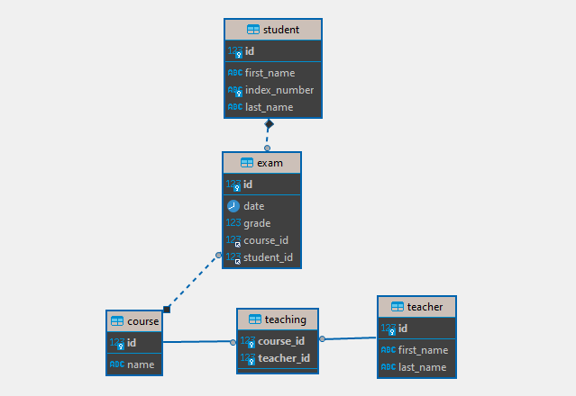

# Serverske veb tehnologije - Vežbe 4

## Potreba za ORM

Na prethodnom terminu smo videli upotrebu JDBC API-ija za komunikaciju sa bazom podataka.
Pisanje SQL metoda za konverziju pomoću JDBC je:

- Zamorno i zahteva mnogo koda
- Podložno greškama
- Nestandardni SQL upiti vezuju aplikaciju za specifičnu bazu
- Promene u modelu zahtevaju promene u upitima
- Teško je predstaviti asocijacije između objekata

Rešenje je u upotrebi sistema za objektno relaciono mapiranje (npr. _Hibernate_). 
Time koristimo API za skladištenje i očitavanje Java objekata u i iz baze. 

### Prednosti upotrebe ORM-a:

- Nema potrebe da se prate posebna pravila ili šabloni dizajna
- Transparentni: objektni model nije svestan konverzije
- Poslovna logika pristupa objektima, a ne tabelama u bazi
- Sakriveni su detalji SQL upita od OO logike
- U pozadini se zasniva na JDBC
- Nema potreba za detaljnijom komunikacijom sa specifičnom relacionom bazom
- Entiteti su prilagođeni poslovnoj logici a ne strukturi baze
- Automatsko upravljanje transakcijama i generisanje ključeva
- Brži razvoj aplikacija

### ORM i arhitektura aplikacije

Postoji sloj koji upravlja perzistencijom i apstrakcijom između modela i baze.

**JPA** (Java Persistence API) omogućava snimanje
POJO (eng. _Plain Old Java Objects_) objekata u relacionu bazu.
API implementira neka konkretna biblioteka – na primer.
Hibernate.

JPA definiše specifikaciju:

- Kako se definišu entiteti?
- Kako se mapiraju veze između entiteta?
- Ko upravlja entitetima?

**Hibernate** je najpopularnija implementacija JPA. On obezbeđuje da se podaci čuvaju/čitaju iz baze na osnovu mapiranja i razume mapiranja koja se prave između objekata i tabela

Uobičajene Objektno-relacione operacije su:

- Create – čuva (perzistuje) novi objekat u bazu
- Retrieve (Read) – čita objekat iz baze
- Update – ažurira objekat već sačuvan u baz
- Delete – briše objekat iz baze

## Elementi JPA

- Entity je POJO klasa sa anotacijom `@Entity`
- Mora imati konstruktor bez parametara
- Dodatno se moze iskoristiti anotacija @Table("naziv_tabele_u_bazi") kojom se specificira
  tačan naziv tabele u bazi, šema kojoj pripada
- Ako se izostavi ova anotacija, dovoljno je imati anotaciju @Entity i u bazi će se kreirati
  tabela sa nazivom klase
- Najčešće se mapira jedna klasa na jednu tabelu
- Atributi klase mapiraju se na kolone tabele
- Parametri mapiranja opisuju se anotacijama (@Column)
- Enumeracije i datumi mogu se konvertovati u odgovarajući tip anotacijama
  `@Enumerated` i `@Temporal`
- Anotacije se vezuju za atribute ili get metode
- Svaki entitet ima svoj surogat ključ (`@Id`) (ili prirodni ključ (`@NaturalId`))
- Strategija generisanja ključeva može se eksplicitno podesiti
  (`@GeneratedValue`):
  - _AUTO_ - generisanje ključeva se oslanja na perzistencionog provajdera da
    izabere način generisanja (ako je u pitanju Hibernate, selektuje tip na osnovu
    dijalekta baze, za najpopularnije baze izabraće _IDENTITY_)
  - _IDENTITY_ - inkrementalno generisanje ključeva pri svakom novom insertu u bazu.
  - _SEQUENCE_ - koriste se specijalni objekti baze da se generišu id-evi.
  - _TABLE_ - postoji posebna tabela koja vodi računa o ključevima svake tabele.

### Tipovi veza između entiteta

- Posmatramo dve klase, A i B, koje su u vezi
- Veza tipa `1:1`
  - klasa A sa atributom tipa B, anotacija `@OneToOne`
  - klasa B sa atributom tipa A, anotacija `@OneToOne`
- Veza tipa `1:N`
  - 1-strana ima anotaciju `@OneToMany`, tip atributa je `Set<B>` ili `List<B>`
  - N-strana ima anotaciju `@ManyToOne`, tip atributa je A
  - N-strana obično ima i anotaciju `@JoinColumn` koja opisuje uslov povezivanja
  - Opciono se može iskoristiti atribut `mappedBy` da se naznači ko je vlasnik veze
  - U bazi će se u tabeli B kreirati dodatna kolona koja će sadržati id objekata tipa A kao strani ključ
  - Ako se izostavi `mappedBy` kreiraće se međutabela koja će sadržati 2 kolone - id klase A i id klase B
- Veza tipa `M:N`
  - M-strana ima anotaciju `@ManyToMany`, tip atributa je` Set<B>` ili `List<B>`
  - N-strana ima anotaciju `@ManyToMany`, tip atributa je `Set<A>` ili `List<A>`
  - Kako u ovom slučaju nastaje treća tabela, mora se naznačiti unutar `@JoinTable` koje kolone će se referencirati pomoću `@JoinColumn`

### Unidirekcione i bidirekcione veze

- Unidirekciona (jednosmerna) veza: klasa A „vidi“ klasu B, a klasa B „ne vidi“
  klasu A
- Bidirekciona (dvosmerna) veza: klasa A „vidi“ klasu B i obrnuto
- Jednosmerna veza se pravi izostavljanjem odgovarajućeg atributa u klasi

### Kaskadiranje u JPA

JPA kod anotacija za veze nudi i
atribut `cascade`

- `CascadeType` podešen na `ALL`
  dozvoljava da se prilikom svakog
  čuvanja, izmene ili brisanja
  studenta čuvaju, menjaju ili brišu i
  kursevi.
- To znači da ne moraju unapred
  da se čuvaju kursevi pa onda
  povezuju sa studentom.

### Fetching u JPA

- Atributom `fetch` može se podešavati
  način dobavljanja povezanih entiteta
- Opcije su `EAGER` i `LAZY`
- `FetchType` odlučuje da li će se učitati i
  sve veze sa odgovarajućim objektom
  čim se inicijalno učita sam objekat ili
  neće
- Ako je `FetchType` `EAGER`, učitaće se
  sve veze sa objektom odmah, a ako je
  `FetchType LAZY`, učitaće se tek pri
  eksplicitnom traženju povezanih
  objekata (pozivanjem npr. metode
  `getCourses`)

## Spring Data Repository

- `Repository` je interfejs koji dozvoljava Spring Data infrastrukturi da prepozna
  korisnički definisane repozitorijume.
  - sam interfejs anotira se sa `@Repository` 
  - `CrudRepository` dodaje osnovne metode poput čuvanja, brisanja i pronalaženja
    entiteta
  - `PagingAndSortingRepository` nasleđuje `CrudRepository` i dodaje metode za pristup
    entitetima stranicu po stranicu i njihovo soritiranje
  - `JpaRepository` nasleđuje PagingAndSortingRepository i dodaje JPA spečificne
    funkcionalnosti poput `flush` i `deleteInBatch`
  
- Repository interfejsi mogu imati samo interfejse metoda napisane u odgovarajućem formatu
  bez dodatne konfiguracije koje će predstavljati upit
  - `findAll()` će formirati upit sličan SQL upitu: `SELECT * FROM table_name`,
  - `findById(Long id)` će formirati upit sličan SQL upitu: `SELECT * FROM table_name WHERE table_name.id =
    id`.
- Ako su upiti malo složeniji, prosto navođenje naziva metoda može da postane prilično nečitljivo.
- Alternativa je pisanje stvarnih upita korišćenjem JPQL/HQL sintakse
- Metoda može da ima proizvoljan naziv ali se mora anotirati anotacijom `@Query`.

## Pokretanje primera

U modelu podataka današnjeg primera se vide klase `Course`, `Exam`, `Student` i `Teacher` nad kojima implementiramo JPA repozitorijume.

Da biste pokrenuli primer JpaExampleApplication, neophodno je da:
  - Uspostavite `MySQL` konekciju i napravite novu šemu baze podataka pod imenom `jpa`. 
  - Podrazumevani kredencijali za konekciju su `root` i `password`.

Alternativno, možete prilagoditi konfiguracione podatke za konekciju sa bazom u `application.properties` za vaše primere.

## Šema baze podataka

Nakon pokretanja aplikacije, `Hibernate` će primeniti anotacije koje su definisane u modelu nad `jpa` šemom i kreirati šemu baze podataka prema dijagramu ispod:

